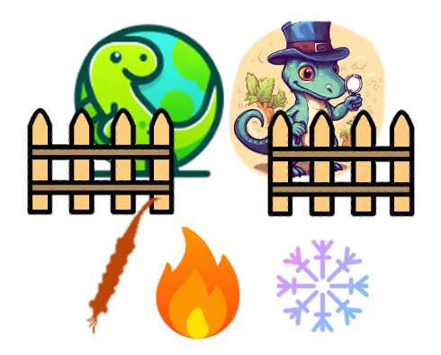
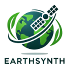
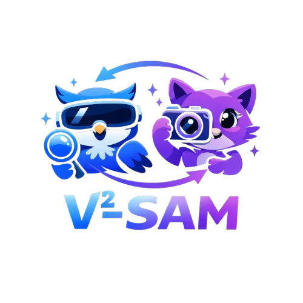

<h1 align="center">👋 Hi there, I’m Jiancheng Pan 🤖</h1>

   

<table>
    <tr>
    <td width="70" align="center">
      <!--  -->
    </td>
    <td>
      
    </td>
    <td>
      <a href="https://github.com/jaychempan/PIR" target="_blank">
      <b>PIR</b> 
      </a> (MM'23 Oral) | 
       Remote Sensing Image-text Retrieval Framework
    </td>
  <tr>
    <td width="70" align="center">
      
    </td>
    <td>
      
    </td>
    <td>
      <a href="https://github.com/jaychempan/LAE-DINO" target="_blank">
      <b>LAE-DINO</b> 
      </a> (AAAI'25) | 
      Foundation Open-Vocabulary Object Detector for Remote Sensing
    </td>
  </tr>
  <tr>
    <td width="70" align="center">
      
    </td>
    <td>
      
    </td>
    <td>
      <a href="https://github.com/jaychempan/ETS" target="_blank">
      <b>ETS</b> 
      </a> (CVPRW'25) | 
      Augmentation-Search Strategy for Cross-Domain Few-Shot Object Detection
    </td>
  </tr>
  <tr>
    <td>
      
    </td>
    <td>
      
    </td>
    <td>
      <a href="https://github.com/jaychempan/EarthSynth" target="_blank">
      <b>EarthSynth</b>
      </a> | 
      Generative Foundation Model for Remote Sensing Task-Oriented Synthesis
    </td>
  </tr>

  <tr>
    <td>
      
    </td>
    <td>
      
    </td>
    <td>
      <a href="https://github.com/jaychempan/V2-SAM" target="_blank">
      <b>V²-SAM</b>
      </a> | 
      Unified Cross-View Object Correspondence Model
    </td>
  </tr>

  <tr>
    <td>
      
    </td>
    <td>
       
      
    </td>
    <td>
      <a href="https://github.com/jaychempan/ccf-ddl-tracker" target="_blank">
      <b>CCF DDL Tracker</b>
      </a> (From CCFDDL®) | 
      A Lightweight Chrome Extension for Tracking CCF Deadlines
    </td>
  </tr>
</table>

